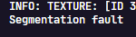

## First game I made with [Raylib](https://raylib.com)

---

# Ideas

> Story
> - Start in Stage 1  with 10HP
> - Josephine can hear you (but you don't know that)
> - You make your way through a maze of rooms
> - You find Josephine (or not) and she attempts to charge at you
> - You die and go back to the start or you find the exit room
> - You have to get Josephine to run into a wall to stun her while you escape down a tunnel.
> - If you stop moving, she will get you

## See level details in ./major_spoilers/Stages.md

